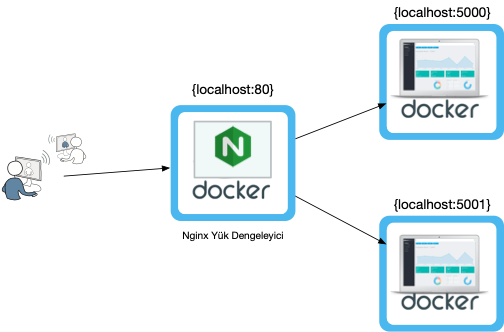

# Nginx Docker Yük Dengeleme: Statik Site
Docker kapsayıcıları kullanılarak 2 farklı Ngnix sunucusunda yayınlanan statik bir sitenin yük dengeleme işlemi Nginx ile yapılmıştır.
* Nginx yük dengeleyici 80 portunda, statik sitelerin örnekleri 5000 ve 5001 portlarında çalışmaktadır.

## Çalıştırma

* sunucu-1 klasörüne terminalde cd komutuyla girin.
* `docker build -t sunucu-1_imaj .` komutu ile sunucu-1 imajını oluşturun.
* `docker run -it --rm -d -p 5000:5000 --name sunucu1 sunucu-1_imaj` komutuyla sunucu-1'i çalıştırın.
* sunucu-2 klasörüne terminalde cd komutuyla girin.
* `docker build -t sunucu-2_imaj .` komutu ile sunucu-1 imajını oluşturun.
* `docker run -it --rm -d -p 5001:5001 --name sunucu2 sunucu-2_imaj` komutuyla sunucu-1'i çalıştırın.
* ana klasöre `cd ..` ile çıkın.
* `docker build -t nginxsunucu .` komutu ile nginx sunucu imajını oluşturun.
* `docker run -it --rm -d -p 80:80 --name nginx nginxsunucu` komutuyla nginx yük dengeleyicisini çalıştırın.
* [localhost:80](localhost) adresine giderek sayfayı sürekli yenilediğinizde nginx yük dengeleme algoritmasına göre Dashboard-1 ve Dashboard-2 arasında geçiş yapıldığını göreceksiniz.

